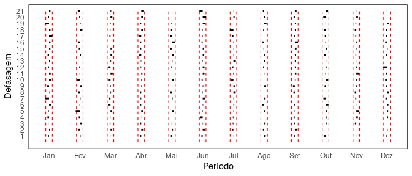
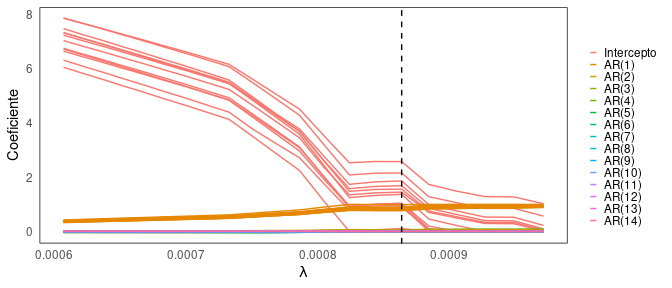
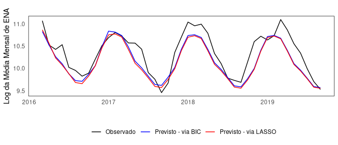

# ENA - Modelagem de séries hidrológicas através do LASSO

(Currently available only in Portuguese)
(Em atualização)

Este repositório é voltado para permitir a replicação do trabalho de monografia **MÉTODOS DE APRENDIZADO DE MÁQUINA APLICADOS A SÉRIES DE ENERGIA NATURAL AFLUENTE**, de minha autoria. Em breve, o trabalho também será disponibilizado.

## Disclaimer

Muitas funções são oriundas do pacote `pear`. Antes de prosseguir, sugiro visitar [essa página](https://cran.r-project.org/web/packages/pear/index.html) e entender o contexto do pacote. Por uma questão de direitos autorais, as funções providas pelo pacote e respectivas adaptações/improvements não serão publicados.


## Preparando os dados

Primeiramente, carrego os pacotes e subrotinas necessárias. Também faço
a parametrização inicial do trabalho. `max.p` corresponde ao número
máximo de defasagens avaliadas para o processo autorregressivo.

``` r
#Carregando dados, pacotes...
options(scipen = 999)

#### RODANDO OS ARQUIVOS DO FINADO PEAR ####
pear_pkg <- list.files(path = '/pear_1.2/')

for (kk in pear_pkg){
  source(file = paste0('/pear_1.2/', kk))
}

source(file = paste0('/v2/subrotinas.R')) #Rodando scripts para algumas funções

###########################################

# Carregando pacotes necssários
library(tidyverse)
library(tseries)
library(zoo)
library(ggfortify)
library(glmnet)
library(bestglm)
library(forecast)

# Esses dois últimos pacotes só são relevantes se você tiver interesse
# em fazer inferência sobre os coeficientes estimados via B&J/BIC
library(sandwich)
library(lmtest)

# Para as saídas em tabela, vou utilizar o kable. Mas você pode substituir por
# xtable
library(knitr)

my_theme <- theme_minimal() +
  theme(panel.grid = element_blank(),
        panel.border = element_rect(fill = NA)) #Tema para gráficos

main_data <- read_csv(paste0(path,'/Bases/main_data.csv')) #Carregando base de
#dados

start_vec <- c(1931, 1) #Início da série original

max.p <- 14 # máximo de 14 defasagens
freq <- 12 # frequência mensal

Y <- ts(main_data$SE, frequency = freq, start = start_vec) #ENA SUDESTE
lnY <- log(Y)
```

Visualizando a série em nível e em log

``` r
autoplot(Y) + my_theme #Nível
autoplot(lnY) + my_theme #Log
```


Para avançar com a estimação, construo as matrizes de defasagens e
*dummies* sazonais. Também defino os conjuntos de treino e teste, bem
como as datas correspondentes às suas observações na série temporal.

``` r
X <- lag_matrix(X = as.matrix(lnY), max.p = max.p) # Matriz com defasagens
D <- seas_dummies(freq = freq, length = length(lnY), start = start_vec[2])
# Dummies sazonais

X <- per.matrix(X = X, D = D, start = start_vec[2]) # Regressores e interações
colnames(D) <- paste0("D_", 1:12)

X <- cbind(D, X) # Aqui a matriz X passa a incluir as dummies de intercepto

test <- (length(lnY)-3.5*12):length(lnY)
# Defino o test set como sendo os últimos 4 anos de dados disponíveis

# Agora defino variáveis que armazenam informações sobre as datas,
# pois o glmnet não opera com objetos do tipo série temporal

lnY %>% time() %>% as.yearmon() -> mon_y
# Continhas para definir, em Ano - Mês, a amostra de teste
dates <- tibble(Y = as.numeric(format(mon_y, "%Y")),
                m = as.numeric(format(mon_y, "%m")))

end_vec <- tibble(dates[-test,1], dates[-test,2]) %>% tail(1) %>% as.numeric()
# Final do training set

start_proj <- c(dates$Y[test][1], dates$m[test][1])
end_proj <- dates %>% tail(1) %>% as.numeric()

months_labs <- c("Jan", "Fev", "Mar", "Abr", "Mai", "Jun", "Jul", "Ago",
                     "Set", "Out", "Nov", "Dez")
```

Checando o boxplot periódico, tanto em log quanto em nível

``` r
gg.monthlyboxplot(Y) + stat_summary(fun = mean, geom="point", shape=20, size=4, color="red", fill="red") +
  stat_summary(fun.data = mean_se, geom = 'errorbar', width=0.2, color = 'red') + my_theme
gg.monthlyboxplot(lnY) + stat_summary(fun = mean, geom="point", shape=20, size=4, color="red", fill="red") +
  stat_summary(fun.data = mean_se, geom = 'errorbar', width=0.2, color = 'red') + my_theme
```


## Estimação via BIC/Box & Jenkins

Correlograma periódico. As funções `gg.peacf` e `gg.peacf.plot` é minha
adaptação para a `peacf` provida pelo `pear` em Base R, por isso não
está disponível nesse repositório.

``` r
detach(package:dplyr, unload = T) # Aprimoramento futuro: confusão com a função
# lag provida pelo dplyr
peacf_bic <- gg.peacf(lnY, lag.max = 14, plot = F)
pepacf_bic <- gg.pepacf(lnY, lag.max = 14, plot = F)
library(dplyr)

gg.peacf.plot(peacf_bic) + scale_x_continuous(breaks = 1:freq, labels = months_labs) #ACF
gg.peacf.plot(pepacf_bic) + scale_x_continuous(breaks = 1:freq, labels = months_labs) # PEACF - Todas estações são pelo menos um AR(1)
```


Rodando o algoritmo de enumeração exaustiva para obtenção de ordens
ótimas de acordo com o critério de Schwarz. Com base na saída do
algoritmo, defino a matriz de regressores para a estimação por OLS.

``` r
time.bic.select <- system.time(bic_morgan(as.numeric(lnY), X, max.p = max.p, freq = freq) -> bic_order)
#Ordens ótimas pelo BIC

Xbic <- X %*% diag(bic_order$l2) %>% `colnames<-`(colnames(X))
# Matriz de regressores para BIC, contendo apenas as variáveis relevantes
```

``` r
bic_order$l2 %>%
  ifelse("&#9745;","") %>%
  my_table() %>%
  kable(caption = "Defasagens escolhidas pela enumeração exaustiva avaliada pelo BIC\\label{tab:ordem}")
```

|                            | Jan | Fev | Mar | Abr | Mai | Jun | Jul | Ago | Set | Out | Nov | Dez |
|:---------------------------|:----|:----|:----|:----|:----|:----|:----|:----|:----|:----|:----|:----|
| Intercepto                 | ☑   | ☑   | ☑   | ☑   | ☑   | ☑   | ☑   | ☑   | ☑   | ☑   | ☑   | ☑   |
| ln(*z*<sub>*t* − 1</sub>)  | ☑   | ☑   | ☑   | ☑   | ☑   | ☑   | ☑   | ☑   | ☑   | ☑   | ☑   | ☑   |
| ln(*z*<sub>*t* − 2</sub>)  |     |     |     |     |     |     |     |     |     |     |     |     |
| ln(*z*<sub>*t* − 3</sub>)  |     |     |     |     | ☑   |     | ☑   | ☑   |     |     |     |     |
| ln(*z*<sub>*t* − 4</sub>)  |     |     |     |     |     |     |     |     |     |     |     | ☑   |
| ln(*z*<sub>*t* − 5</sub>)  |     |     |     |     |     |     |     |     |     |     |     |     |
| ln(*z*<sub>*t* − 6</sub>)  |     |     |     |     |     |     |     |     |     | ☑   |     |     |
| ln(*z*<sub>*t* − 7</sub>)  |     |     |     |     |     |     |     |     |     |     |     |     |
| ln(*z*<sub>*t* − 8</sub>)  |     |     |     | ☑   |     |     |     |     |     |     |     |     |
| ln(*z*<sub>*t* − 9</sub>)  |     |     |     |     | ☑   |     |     |     |     |     |     |     |
| ln(*z*<sub>*t* − 10</sub>) |     |     |     |     |     |     |     |     |     |     |     |     |
| ln(*z*<sub>*t* − 11</sub>) |     |     | ☑   |     |     |     | ☑   |     |     |     |     |     |
| ln(*z*<sub>*t* − 12</sub>) |     |     |     |     |     |     |     |     |     |     |     |     |
| ln(*z*<sub>*t* − 13</sub>) |     |     |     |     | ☑   |     |     |     |     |     |     |     |
| ln(*z*<sub>*t* − 14</sub>) | ☑   |     |     |     | ☑   |     | ☑   |     |     |     |     |     |

Defasagens escolhidas pela enumeração exaustiva avaliada pelo BIC

Finalmente, podemos estimar o modelo via OLS

``` r
time.bic.estim <- system.time(glm(as.numeric(lnY)[-test] ~ 0 + Xbic[-test,]) -> model_bic)

start_estim_bic <- c(dates[(length(lnY[-test]) - model.matrix(model_bic) %>% nrow() + 1),1],
                 dates[(length(lnY[-test]) - model.matrix(model_bic) %>% nrow() + 1),2])
# esse par é pra tirar ano e mês que são usados na estimação
# descontando observações perdidas na etapa de diferenciação

cluster_se <- coeftest(model_bic, vcov = vcovHC(model_bic,type="HC0",cluster=Xbic[-test,1:12] %*% as.matrix(c(1:12), ncol = 1))) %>%
  broom::tidy() %>% select(term, std.error, p.value) %>% rename(adj.std.error = std.error, adj.p.value = p.value)

bic_tidied <- broom::tidy(model_bic) %>%
  left_join(cluster_se, by = "term")


bic_tidied %>% select(estimate) -> betas_bic
bic_tidied %>% select(adj.std.error) -> se_bic
bic_tidied %>% select(adj.p.value) -> pval_bic

ifelse(pval_bic <= 0.01, "$^{{\\scriptscriptstyle ***}}$",
       ifelse(pval_bic <= 0.05, "$^{{\\scriptscriptstyle **}}$",
              ifelse(pval_bic <= 0.1, "$^{{\\scriptscriptstyle *}}$", ""))) -> signif_bic
signif_bic <- signif_bic %>% replace_na("")

res_bic <- ts(residuals(model_bic), frequency = freq, start = start_estim_bic)
# Tomando os resíduos
```

``` r
# Neste bloco não tem estimação. É mera organização das saídas

round(betas_bic, 2) %>% as.matrix() %>%
  as.character() %>%
  str_replace("\\.",",") %>%
  paste0(signif_bic) %>%
  str_replace("NA","") %>%
  my_table() %>%
  kable(caption = "Saída do modelo estimado com BIC - Estimativas\\label{tab:modelbic}")
```

|                            | Jan                     | Fev                     | Mar                     | Abr                     | Mai                      | Jun                     | Jul                      | Ago                     | Set                     | Out                     | Nov                     | Dez                     |
|:---------------------------|:------------------------|:------------------------|:------------------------|:------------------------|:-------------------------|:------------------------|:-------------------------|:------------------------|:------------------------|:------------------------|:------------------------|:------------------------|
| Intercepto                 | 1,34<sup>\*</sup>       | 3,02<sup>\* \* \*</sup> | 1,99<sup>\* \* \*</sup> | 0,3                     | 1,35<sup>\*</sup>        | 0,6                     | 0,71<sup>\*</sup>        | 0,61<sup>\*</sup>       | -0,42                   | 0,83                    | 2,84<sup>\* \* \*</sup> | 1,36<sup>\*</sup>       |
| ln(*z*<sub>*t* − 1</sub>)  | 0,65<sup>\* \* \*</sup> | 0,61<sup>\* \* \*</sup> | 0,59<sup>\* \* \*</sup> | 0,7<sup>\* \* \*</sup>  | 0,42<sup>\* \* \*</sup>  | 0,91<sup>\* \* \*</sup> | 0,67<sup>\* \* \*</sup>  | 0,62<sup>\* \* \*</sup> | 1,06<sup>\* \* \*</sup> | 0,53<sup>\* \* \*</sup> | 0,63<sup>\* \* \*</sup> | 0,55<sup>\* \* \*</sup> |
| ln(*z*<sub>*t* − 2</sub>)  |                         |                         |                         |                         |                          |                         |                          |                         |                         |                         |                         |                         |
| ln(*z*<sub>*t* − 3</sub>)  |                         |                         |                         |                         | 0,23<sup>\* \* \*</sup>  |                         | 0,27<sup>\* \* \*</sup>  | 0,27<sup>\* \* \*</sup> |                         |                         |                         |                         |
| ln(*z*<sub>*t* − 4</sub>)  |                         |                         |                         |                         |                          |                         |                          |                         |                         |                         |                         | 0,31<sup>\* \* \*</sup> |
| ln(*z*<sub>*t* − 5</sub>)  |                         |                         |                         |                         |                          |                         |                          |                         |                         |                         |                         |                         |
| ln(*z*<sub>*t* − 6</sub>)  |                         |                         |                         |                         |                          |                         |                          |                         |                         | 0,35<sup>\* \* \*</sup> |                         |                         |
| ln(*z*<sub>*t* − 7</sub>)  |                         |                         |                         |                         |                          |                         |                          |                         |                         |                         |                         |                         |
| ln(*z*<sub>*t* − 8</sub>)  |                         |                         |                         | 0,27<sup>\* \* \*</sup> |                          |                         |                          |                         |                         |                         |                         |                         |
| ln(*z*<sub>*t* − 9</sub>)  |                         |                         |                         |                         | 0,21<sup>\*</sup>        |                         |                          |                         |                         |                         |                         |                         |
| ln(*z*<sub>*t* − 10</sub>) |                         |                         |                         |                         |                          |                         |                          |                         |                         |                         |                         |                         |
| ln(*z*<sub>*t* − 11</sub>) |                         |                         | 0,16<sup>\*</sup>       |                         |                          |                         | 0,18<sup>\*\*</sup>      |                         |                         |                         |                         |                         |
| ln(*z*<sub>*t* − 12</sub>) |                         |                         |                         |                         |                          |                         |                          |                         |                         |                         |                         |                         |
| ln(*z*<sub>*t* − 13</sub>) |                         |                         |                         |                         | 0,33<sup>\*\*</sup>      |                         |                          |                         |                         |                         |                         |                         |
| ln(*z*<sub>*t* − 14</sub>) | 0,2<sup>\* \* \*</sup>  |                         |                         |                         | -0,38<sup>\* \* \*</sup> |                         | -0,23<sup>\* \* \*</sup> |                         |                         |                         |                         |                         |

Saída do modelo estimado com BIC - Estimativas

``` r
###

# Vetor de coeficientes, para calibragem posterior
betas_bic[is.na(betas_bic)] <- 0
betas_bic <- as.matrix(betas_bic)
```

### Análise dos Resíduos

Função de autocorrelação periódica nos resíduos. Também construo uma
lista com informações para parametrizar o teste de Ljung-Box.

``` r
detach(package:dplyr, unload = TRUE)

gg.peacf(res_bic, plot = F) -> peacf_res_bic # Objeto p peacf dos resíduos

ljung_box_bic <- list(period = 1:freq, # Montando uma lista p organizar o teste ljung-box a partir das saídas do pear
                      lag = ncol(peacf_res_bic$portmanteau.test$QM.df),
                      df = peacf_res_bic$portmanteau.test$
                        QM.df[,ncol(peacf_res_bic$portmanteau.test$QM.df)], # graus de liberdade
                      Qstat = peacf_res_bic$portmanteau.test$
                        QM[,ncol(peacf_res_bic$portmanteau.test$QM)]) # estatística de teste

ljung_box_bic$pval <- 1 - pchisq(ljung_box_bic$Qstat, df = ljung_box_bic$df) # pvalores
```

``` r
gg.peacf.plot(peacf_res_bic) + scale_x_continuous(breaks = 1:freq, labels = months_labs)
```



Em seguida, o teste de Ljung-Box periódico

``` r
ljung_box_plot(ljung_box_bic) + scale_x_continuous(breaks = 1:freq, labels = months_labs)
```


No bloco a seguir, computo as projeções dinâmicas para avaliação
*out-of-sample* do modelo estimado com BIC

``` r
dyn_predict(beta = betas_bic, y = as.numeric(lnY)[-test],
            max.p = max.p,
            h = length(test), start = start_vec[2]) -> bic_fit
# Valores preditos pelo BIC
```

## Estimação com o LASSO

No bloco seguinte, procedo com o LASSO: escolha de um *λ* ótimo,
estimação e cômputo dos resíduos no training st

``` r
library(dplyr)
# Estimando via LASSO

lambdas <- 10.5^seq(-3.15, -2.95, by = .01) # Vetor de possíveis lambdas

lambda <- lambda_best2(y = as.numeric(lnY)[-c(1:max.p, test)],
                      X = as.matrix(X)[-c(1:max.p, test),], valid.size = 48,
                      start = start_vec[2], max.p = max.p,
                      lambdas = lambdas) # Escolhendo o lambda
lambda$lambda <- 0.00078
time.lasso <- system.time(model_lasso <- glmnet::glmnet(x = as.matrix(X)[-c(1:max.p, test),],
                              y = as.numeric(lnY)[-c(1:max.p, test)],
                              alpha = 1, lambda = lambda$lambda,
                              standardize = F, family = 'gaussian', intercept = F))

start_estim_lasso <- dates[max.p+1,] %>% as.numeric()

res_lasso <- ts((as.numeric(lnY)[-c(1:max.p, test)] -
                   predict(model_lasso, as.matrix(X)[-c(1:max.p, test),])),
                frequency = 12, start = start_estim_lasso)
```

``` r
# Novamente, apenas organizando a saída em tabela
ifelse(model_lasso$beta == 0,
       "",
       ifelse(round(model_lasso$beta,3) == 0,
              "0.000",
              round(model_lasso$beta,3))) %>%
  str_replace("\\.",",") %>%
  my_table() %>%
  kable(caption = paste0("Saída do LASSO para $\\lambda =",
                         round(lambda$lambda, 5),"$\\label{tab:modellasso}"))
```

|                            | Jan   | Fev   | Mar   | Abr   | Mai   | Jun   | Jul   | Ago   | Set   | Out   | Nov   | Dez   |
|:---------------------------|:------|:------|:------|:------|:------|:------|:------|:------|:------|:------|:------|:------|
| Intercepto                 | 1,051 | 1,166 | 1,134 | 0,788 | 0,808 | 0,47  | 0,357 | 0,368 |       | 0,581 | 0,813 | 0,78  |
| ln(*z*<sub>*t* − 1</sub>)  | 0,881 | 0,851 | 0,849 | 0,88  | 0,873 | 0,926 | 0,938 | 0,935 | 0,998 | 0,932 | 0,905 | 0,895 |
| ln(*z*<sub>*t* − 2</sub>)  | 0,000 | 0,000 | 0,000 | 0,000 | 0,000 | 0,000 | 0,000 | 0,000 | 0,000 | 0,000 | 0,000 | 0,028 |
| ln(*z*<sub>*t* − 3</sub>)  |       | 0,000 | 0,000 | 0,000 | 0,000 |       | 0,000 | 0,000 |       | 0,000 | 0,000 | 0,000 |
| ln(*z*<sub>*t* − 4</sub>)  | 0,000 |       | 0,000 | 0,000 | 0,000 |       | 0,000 |       |       | 0,000 | 0,000 | 0,000 |
| ln(*z*<sub>*t* − 5</sub>)  | 0,000 |       | 0,000 |       | 0,000 | 0,000 | 0,000 |       |       |       | 0,000 |       |
| ln(*z*<sub>*t* − 6</sub>)  | 0,000 | 0,000 |       |       |       | 0,000 |       |       |       | 0,000 |       |       |
| ln(*z*<sub>*t* − 7</sub>)  |       | 0,000 |       | 0,000 |       | 0,000 |       | 0,000 |       |       |       |       |
| ln(*z*<sub>*t* − 8</sub>)  | 0,000 | 0,000 |       |       |       |       |       |       |       | 0,000 | 0,000 |       |
| ln(*z*<sub>*t* − 9</sub>)  |       | 0,000 |       |       |       |       |       |       |       |       | 0,000 |       |
| ln(*z*<sub>*t* − 10</sub>) | 0,000 |       |       |       |       |       |       |       | 0,000 |       | 0,000 |       |
| ln(*z*<sub>*t* − 11</sub>) |       | 0,000 | 0,000 |       |       |       |       |       | 0,000 |       |       |       |
| ln(*z*<sub>*t* − 12</sub>) |       |       |       |       |       |       |       |       | 0,000 |       |       |       |
| ln(*z*<sub>*t* − 13</sub>) | 0,000 | 0,000 |       |       |       |       |       |       |       |       |       |       |
| ln(*z*<sub>*t* − 14</sub>) | 0,000 |       |       |       |       |       |       | 0,000 |       |       |       |       |

Saída do LASSO para *λ* = 0.00078

A trajetória dos coeficientes em função de *λ*

``` r
lambda.coef(X = as.matrix(X)[-c(1:max.p, test),], y = as.numeric(lnY)[-c(1:max.p, test)], freq = freq, max.p = max.p, lambdas = lambdas) + geom_vline(xintercept = lambda$lambda, linetype = "dashed") + my_theme + 
  #guides(color = guide_legend(ncol=2)) +
  theme(legend.key.size = unit(0.2, "cm"))
```



### Análise dos Resíduos

Em procedimento análogo ao realizado para o modelo estimado com BIC, são
avaliados a Função de Autocorrelação Periódica e o teste de Ljung-Box
nos resíduos do modelo estimado com o LASSO.

``` r
detach(package:dplyr, unload = TRUE)
gg.peacf(res_lasso, plot = F) -> peacf_res_lasso

ljung_box_lasso <- list(period = 1:freq,
                      lag = ncol(peacf_res_lasso$portmanteau.test$QM.df),
                      df = peacf_res_lasso$portmanteau.test$
                        QM.df[,ncol(peacf_res_lasso$portmanteau.test$QM.df)],
                      Qstat = peacf_res_lasso$portmanteau.test$
                        QM[,ncol(peacf_res_lasso$portmanteau.test$QM)])
                      
ljung_box_lasso$pval <- 1 - pchisq(ljung_box_lasso$Qstat, df = ljung_box_lasso$df)
```

``` r
gg.peacf.plot(peacf_res_lasso) + scale_x_continuous(breaks = 1:freq, labels = months_labs)
```


``` r
ljung_box_plot(ljung_box_lasso) + scale_x_continuous(breaks = 1:freq, labels = months_labs) #afasta autocorrelação em 
```


## Comparação do tempo para execução

Seleção com o BIC: 0.113

Estimação com o BIC: 0.07

Somados: 0.183

Estimação e seleção com o LASSO: 0.019

O tempo de execução para seleção e estimação com BIC neste experimento
foi 9.6315789 vezes superior ao do LASSO. Naturalmente, este tempo tende
a variar de máquina para máquina.

## Previsão

Para fins de avaliação da capacidade preditiva, para ambos os modelos, é
projetada uma trajetória com base em dados observados do conjunto de
treino e subsequentes valores preditos correspondentes à parcela
censurada para estimação e reservada para teste. As duas trajetórias
são, então, comparadas com os valores observados para a amostra de
teste.

``` r
library(dplyr)
dyn_predict(beta = as.numeric(model_lasso$beta), y = as.numeric(lnY)[-test],
            max.p = max.p, h = length(test), start = start_vec[2]) -> lasso_fit

#continhas
lnYproj <- window(lnY, start = start_proj, end = end_proj)
ts_bic_fit <- ts(bic_fit, start = start_proj, frequency = 12)
ts_lasso_fit <- ts(lasso_fit, start = start_proj, frequency = 12)

r2bic <- 1 - sum((lnYproj - ts_bic_fit)^2) / (sd(lnYproj) * (length(lnYproj)-1))
r2lasso <- 1 - sum((lnYproj - ts_lasso_fit)^2) / (sd(lnYproj) * (length(lnYproj)-1))

proj <- ts.union(lnYproj, ts_bic_fit, ts_lasso_fit)
```

``` r
autoplot(proj, facets = F) +
  scale_color_manual(labels = c("Observado", "Previsto - via BIC",
                                "Previsto - via LASSO"),
                     values=c("black", "blue", "red")) +
  my_theme + theme(legend.position =  "bottom") +
  labs(color = "", y = "Log da Média Mensal de ENA", x = "")
```




## Bonus track - coming soon!
